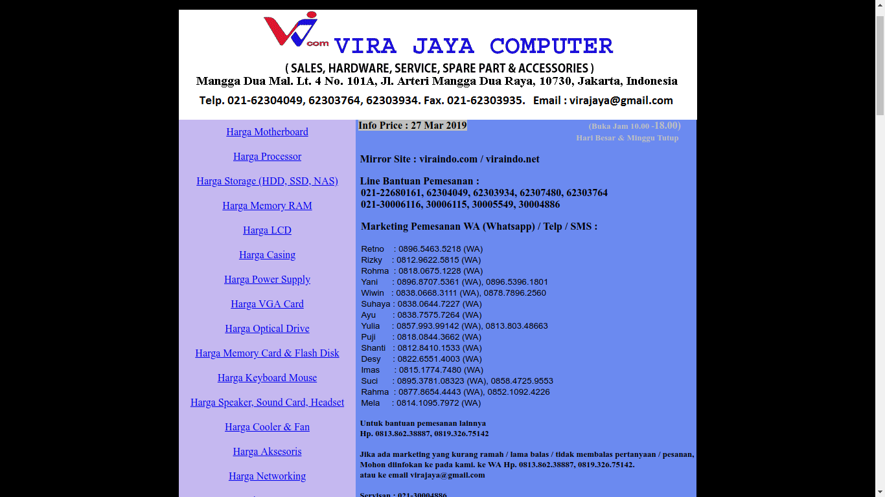

# Crappy Design Project

Welcome to **_Crappy Design Project_**, yet another HCI final project.


**Crappy Design Project** is brought to you by Dwipangga. We will ~~_talk_~~ criticize a website with ~~_crappy_~~ **bad** design which significantly affects the user while interacting with the website. 

Sounds boring? Okay, we admit it :)

Let's add some boreness level by introducing ourselves in boring way.

## Team Members:

<!-- Seriously, I will change this whole introduction chapter later, with a BANG :v -->

> Name: Akmal Darari Rafif Baskoro  
> NRP: 05111640000148  
> 
> Name: Deddy Aditya P  
> NRP: 05111640000069  
> 
> Name: Dennas Hasel Adjani  
> NRP: 05111640000113  
> 
> Class: HCI A  

We think that's all our boring introduction. Now what?

## Our Target

Ah... We're forget to tell what kind of website will we criticize for this project. Now, meet our target...



Can you guess it? No idea? Ok, we will introduce it for you.

> **viraindo.com** is a website of a computer store which located at Mangga Dua Mall, Jakarta. **viraindo.com** is owned by Vira Jaya Computer. They provide the information about the price of computer parts they sell. As a big computer store, viraindo has a large collection of computer parts. This site was created to ease the customers while checking the price of computer parts on their store. 
>
>Many people, if want to buy computer parts and laptop, they refrence to this website (Because, in Viraindo, they show the price and the specifications (in Laptop section) with clear and many brands and types of Laptop showed on that website. And some of the person who gives recomendation on the Consultant of Notebook Specification forum in one of largest web forum in Indonesia, many of them using Viraindo website to give a recomendation to which was asking on this forum because of the lot of brands and clear specification to show it with reasonable price)

## Table of Content

Okay, if you want to know the overview what will we talk here, here is some `generic` Table of Content:

- [Crappy Design Project](#crappy-design-project)
  - [Team Members:](#team-members)
  - [Our Target](#our-target)
  - [Table of Content](#table-of-content)
  - [Why viraindo design is bad?](#why-viraindo-design-is-bad)
  - [Part A: Let's Evaluate The Usability of The Target](#part-a-lets-evaluate-the-usability-of-the-target)
    - [1. Know Our Participants](#1-know-our-participants)
      - [a. Description of Participant 1](#a-description-of-participant-1)
      - [b. Description of Participant 2](#b-description-of-participant-2)
      - [c. Description of Participant 3](#c-description-of-participant-3)
      - [d. Description of Participant 4](#d-description-of-participant-4)
    - [2. What our participant should do?](#2-what-our-participant-should-do)
    - [3. Transcript](#3-transcript)
      - [a. Transcript with Participant 1](#a-transcript-with-participant-1)
      - [b. Transcript with Participant 2](#b-transcript-with-participant-2)
      - [d. Transcript with Participant 4](#d-transcript-with-participant-4)
    - [4. Feedback and Incidence Analysis](#4-feedback-and-incidence-analysis)
      - [Observation of Participant 1](#observation-of-participant-1)
        - [Flow Model:](#flow-model)
      - [Observation of Participant 2](#observation-of-participant-2)
        - [Flow Model:](#flow-model-1)
      - [Observation of Participant 3](#observation-of-participant-3)
        - [Flow Model:](#flow-model-2)
      - [Observation of Participant 4](#observation-of-participant-4)
        - [Flow Model:](#flow-model-3)
    - [5. Do and Don't](#5-do-and-dont)
      - [Consider to DO these things](#consider-to-do-these-things)
      - [Please DON'T do these things](#please-dont-do-these-things)
  - [Part B: Prototyping](#part-b-prototyping)
    - [1. Sketch](#1-sketch)
    - [2. Design Rationale](#2-design-rationale)
    - [3. High-Fidelity Interactive-Prototype](#3-high-fidelity-interactive-prototype)

## Why viraindo design is bad?

1. Layout,The overall layout of the website is misplaced as contact info and such should be placed on bottom but this placed on the header and there is many thing beside that
2. The category tab,Category tab doesn't explain anything and lack information which in this case which belong to software ,hardware and
things that can be used get go.
3. Ads is located at the bottom and takes of 30% website and takes too much quota to load.
4. The list ,when you press and redirect you to list of product you can't sort it in any way which make it hassle to find specific product.
5. Bad mobile Optimization.

---

## Part A: Let's Evaluate The Usability of The Target

### 1. Know Our Participants

Let we introduce some people that kind enough to help our task.

#### a. Description of Participant 1
- A Male Student
- 21 Years Old
- Study at ITS, Departement of Physics (2016)
- Relatively medium level of IT Knowledge

#### b. Description of Participant 2
- A Male Student
- 21 Years Old
- Study at ITS, Departement of Information System (2016)
- Relatively advanced level of IT Knowledge

#### c. Description of Participant 3
- A Male Student
- 21 Years Old
- Study at ITS, Departement of Informatics (2016)
- Relatively advanced level of IT Knowledge

#### d. Description of Participant 4
- A Male Student
- 22 Years Old
- Study at ITS, Departement of Information System (2015)
- Relatively advanced level of IT Knowledge

#### e. Description of Participant 5
- A Female Student
- 21 Years Old
- Study at ITS, Departement of Information System (2016)
- Relatively advanced level of IT Knowledge

### 2. What our participant should do?

Here is some ~~extremely torturing~~ tasks that we will ask the participant to do it.

1. Please search a computer part in Viraindo. (The computer part can be anything depend on innterviewer)
2. Please search some other computer parts in Viraindo
(if the time still enough)

### 3. Transcript

Just yet another generic transcript. Consider to read it if you're interested how ~~sad~~ our participants complete the tasks.

```
Note:
P: Participant, M1: Deddy, M2: Akmal, M3: Dennas
```

#### a. Transcript with Participant 1

```
1. M2: Kamu tau website Viraindo.com gak?
2. P: Apa?
3. M2: Viraindo.com
4. P: Wah, aku gak tau. Kayaknya belum pernah denger aku
5. M2: Nah, website viraindo.com itu buat ngecek2 harga yang berhubungan dengan komputer dan HP. Nah, sekarang kamu coba buka website Viraindo.com di HP mu
6. <Some talks>
7. P: Oalah ini, ini kok websitenya.... Vira Jaya Komputer ya ini?
8. M2: Nah bener, sekarang ku kasih tugas. Coba kamu cari harga monitor merek Asus tapi yang terkecil dan biasa dan termurah harganya berapa?
9. P: Adanya 15,6 inci
10. M2: Benar
11. P: Ya sudah, sudah ketemu kan? Benar kan harganya 795 ribu yang paling murah?
12. M2: Lho aku salah lihat, Tadi apa? Layar ya?
13. P: Ya, layar
14. M2: Depannya selalu diawali dengan merek kan?
15. P: Iya
16. P: Nah ini sudah ketemu, 795 ribu
17. M2: Nah sip, sekarang kamu cari keyboard wireless yang paling murah harganya berapa dan mereknya apa?
18. P: Keyboard, oke... berati masuknya di..... keyboard dan mouse
<Searching>
19. P: Sudah ketemu
20. M2: Mereknya apa dan harganya berapa?
21. P: Logitech M238 60rb
22. M2: Oke.....
23. P: Yang harganya 170rb ya? Oh kamu lihatnya mouse ya..... yang bener keyboard
24. M2: Oh iya, tak kira mouse biasa, ternyata yang wireless...
25. M2: Padahal, kalau kamu nyari mouse wireless paling murah bener logitech tapi harganya 110rb
26. P: Oalah ini tah, Logitech M170
27. M2: Satu lagi...... Coba kamu cari laptop.... Jangan deh setelah dibuka ternyata berat di HP
28. P: Bukannya HPmu baru ya?
29. M2: Nggak udah dua tahun. Nah ketemu, sekarang kamu nyari Hard Disk External 1 TB, ukuran berapapun, merek apapun, tapi yang harganya paling murah
<Searching>
30. P: Aku dah nemu nih...... A Data HV620 USB 3.0 harganya 670 ribu
31. M2: Sekarang ku tanya, itu tulisannya di bold apa gak
32. P: Nggak
33. M2: Kalau yang dibold paling murah
34. P: Harganya 760rb ya? Merek WDC
35. M2: Iya, sekarang ku tanyain. Feedback darisini apa?
36. P: Menurutku tampilannya rumit buanget. Nah kan disini lihatnya kyk gambar, karena ini kyk satu gambar jadi kalau dilihat pakai HP kan susah banget. Belum mbesarinnya, belum geser2nya, belum lagi kalau mau komparasi antar barang lah. Maksudnya ini lengkap tapi secara visualisasinya rumit
37. M2: Dari situ kamu bisa gak ngeliat barang yg ready stock mana tanpa kamu tanyain ke CS nya
38. P: Saya rasa sih nggak
39. M2: Yaudah, itu aja yaaa......
```

#### b. Transcript with Participant 2

```
1. M1: Sekarang coba kamu nyari HDD External 1 TB yang paling murah
2. P: Ini bukan?
3. M1: Itu external bukan? Aku bilang apa, HDD External paling murah 1 TB
4. P: Ini ya, bukan. Apaan kok terlalu sini, harusnya dibawah lah biar gak salah paham
5. P: 5 Juta, duh bingung gue
6. P: Kan, yang ada malah 3. Duh pusing banget
7. P: Gak ada searchboxnya ya?
8. M1: Itu bukan situs kita ya...
9. M2: Itu situsnya orang lain....
10. P: Ini apa? Apakah harus external
11. M2: Hmm.... gimana ya.....
12. P: Ya begitulah, tapi semuanya gak konsisten. Harusnya ditaruh bawah aja jangan di wrap terus dipertegas pembatasnya biar gak bingung
13. M1: Sudah menemukan?
14. P: Masih bingung, awalnya ku lihat ini eksternal, tapi gak konsisten sih
15. M1: Iya sih, tapi lakukan aja
16. P: Tuh kan harus geser2 lagi, padahal kalau disatuin kan enak gak perlu geser2
17. M1: Sudah menemukan kah?
18. P: Gak inget tapi tadi ketemu 8jt
19. M1: Yaudah deh, jangan SSD tapi harddisk biasa aja, kan SSD mahal
20. P: Well, cara bedainnya gimana? Soalnya kan gak diwrap jadi satu
21. M1: Ya scroll aja, siapa tau diamana?
22. P: Ini sih aku nemu 960 GB harganya nyaris 7jt
23. M1: Bener sih cuma bukan itu yang yang kuinginkan
24. P: Sumpah bikin sakit mata gara2 ngeliat websitenya kyk gini
25. M2: HUAHAHAHAHAHAHAHA
26. P: Kalau dibahas kyk marketplace lain kan ada harga, ada gambar.... Tapi belum tau ini eksternal apa internal kadang. Dan ada search boxnya pula. Bingo, kyk ini kan? Kan enak dilihat klu kyk gini daripada lihat tabel bikin sakit mata. Yang itu kamu harus ngezoom terus kalau di marketplace lain satu produk udah satu halaman dan harganya udah ketahuan juga
27. M1: Nah, seperti itulah yang ku mau
28. M1: Masih mau nyelesaikan tugas ini?
29. P: Gak deh, NYERAHHHHH. Mataku udah sakit tadi
30. M1: Oke
 ```

#### c. Transcript with Participant 3

```
1. M2: Sekarang kamu coba buka website Viraindo, terus cariin aku laptop HP tipe Elitebook yang paling murah
2. P: Udah ketemu, HP Elitebook 2560P Ex Display 4.850.000
3. M2: Udah ketemu kan? Sekarang, coba cariin optical drive internal, harus bluray combo, tapi harganya juga murah
4. P: Bentar ya.......
5. P: Ketemu, BluRay Combo Samsung 730.000
6. M2: Sekarang terakhir, cariin aku HDD External 1 TB tapi dengan harga yang paling murah.....
<Searching>
7. P: Harus ya eksternal? Prettt dah susah buanget :D
8. M2: Iya dong
9. P: Adata HV620 1TB USB 3.0 670.000
10. M2: Mantap, setelah itu menurutmu website ini gimana?
11. P: Feedback ya, ya kayak brosur raksasa. Harusnya sih dibuat data yang bisa difilter (Contoh: Kalau laptop bisa difilter dengan hardware dan mereknya). Sama sorting dari harga juga
12. M2: Okedeh
 ```

#### d. Transcript with Participant 4

```
1. M1: Jadi, ini ada situs namanya viraindo.com, Coba masnya di situs ini cari harga HDD External 1 TB yang paling murah
2. M2: Dan bukan SSD
3. P: Ribet banget, website apa ini? Nyerah nyerah nyerah
4. M1: Komentar aja gpp
5. M2: Komentar sepuasnya mas gpp
6. P: Jadi komentar saya dikasih case ini dan saya cek harganya. Ternyata saya disuguhkan dengan interface website yang gak manusiawi. Kenapa gak manusiawi? Meskipun yang matanya normal seperti saya juga akan merasa kesulitan. Interfacenya tidak baku, sangat tidak proporsional, fontnya juga, ini ada bold dan tidak dan blablabla gak ada keterangannya. Pokoknya perlu perbaikan besar-besaran di UInya lah
7. M1: Iya mas. Untuk masnya bisa menemukan kan untuk di web ini?
8. P: Non SSD kan?
9. M1: Iya, non SSD 1 TB yang paling murah dan eksternal
10. P: Ini nyari sampai ketemu kan? Aku ingin menyerah sumpah, udah pedas mataku
11. P: Adanya 1 juta lebih
12. M2: Gimana mas? Nyerah kah?
13. P: Nyerah aku
14. M2: Yaudah, tak kasih yang gampang aja. Coba cari Printer Laserjet yang paling murah merek apa saja gak ada ketentuan itu warna atau hitam putih
15. P: Laserjet? Itu mereknya?
16. M2: Itu jenis. Bukan mereknya. Ya mereknya bebas pokoknya paling murah
17. P: Apa nih harga 300rb? Kertas canon
18. M2 & M1: HWAHAHAHAHAHAHA
19. P: Tadi nemu 500rb. Itu nemunya gimana sih?
20. M2: Biasanya ada keterangannya
21. P: Gak ada tombol searchnya kan?
22. M2: Gimana ya....
23. P: Nemu, HP 200rb nemu nih
24. M2: Hmm.... okelah....
25. M1: Sudah berhasil ya.... Silahkan bisa komentar mas
26. P: Tetap seperti tadi, UInya terlalu tidak fit dengan layar. Kalau kyk gini kelihatan kayak excel. Kalau bisa lebih dimudahkan ada fitur search by sama sorting. Pokoknya lebih diperbaiki lagi lah mengikuti kaidah UI dan UX
27. M2: Yaudah itu aja ya mas.... Makasih
```
#### e. Transcript with Participant 5

```
1. M2: Sebelumnya kamu udah tau website Viraindo.com belum?
2. P: Belum
3. M2: Nah, website viraindo.com itu buat nyari2 harga yang berhubungan dengan komputer dan HP. Nah, sekarang kamu coba buka website Viraindo.com di HP mu
4. P: Oalah, kayak.... tapi cuma pricelist doang ya?
5. M2: Iya, tapi ada spesifikasinya dikit2 sih. Nah sekarang coba kamu cari website viraindo.com. Dari situ coba kamu cari harga power supply yang paling mahal tapi mereknya bukan Corsair dan Cooler Master
6. P: Dimana ya......
7. P: Banyak dan ribet bangetttt.............
8. P: FSP?
9. M2: FSP? Harganya 8,850jt bukan?
10. P: Iya tadi
11. M2: Ya benar, yang kedua kamu cari harga Processor Intel yang paling murah seri Coffee Lake
12. P: Processor ya?
13. M2: Yups
14. P: Coffee Lake itu yang mana ya? Kayak Xeon gitu ya?
15. M2: Bukan, itu serinya. Mau tipe Pentium, Core i3, apa Core i7 terserah. Pokoknya coffee lake yang paling murah
16. P: Yang Intel gak ada seri Coffee Lake ya?
17. M2: Nyerah?
18. P: Nyerah deh
19. M2: Sini tak kasih tau padahal ada. Coba zoom di HP mu, Ini lho
20. P: Ealahhhh.....
21. M2: Nah, dari dua tugas ini, ada kesimpulan dan feedback gak buat website ini
22. P: Banyak sih. Yang pertama warna. Warnanya abu-abu dan biru dan tulisannya biru ya gak jelas banget. Yang kedua fontnya, fontnya besar kecilnya kurang pas
23. M2: Terus?
24. P: Yang paling penting gak ada search, paling nyulitin banget soalnya lebih enak. Jadi ya praktis tinggal search semisal pas Power Supply tadi itu ya. Terus ya bentuknya kyk list-list gitu dan tentunya buanyak banget. Jadi bikin susah. Dan tulisannya juga terlalu kecil dan gak ada filternya
25. M2: Adalagi?
26. P: Susunannya dirapiin dan dan layoutnya mending dibenerin lagi. Sama dikasih sedikit animasi gitu bisa gak sih?
27. M2: Itu aja?
28. P: Iya
29. M2: Makasih yaaaa.........
 ```

### 4. Feedback and Incidence Analysis

Let's summarize how the participant's reaction during interview...

#### Observation of Participant 1


 - **Reference**: Line 36 and 38
 - **Feedback**: There is very lot of product. But, the visualization is very confusing and it's very tricky for searching something on this website especially from smartphone (36) (Note: The Participant test this website using smartphone). No footnotes about the product. Where the product is ready, or out of stock, or must order first (38)
 - **Incidence**: After searching the mouse and keyboard, i want to add the task about searching some laptop. But, it's cancelled because the participant smartphone was freezed and stucked
 - **Reason**: The UI was too painful and too heavy especially if we open with smartphone whick have medium to low specs (The participant phone is using Samsung Galaxy J1 which is not too fast)
 - **Resolution**: Changed the UI from scratch. And make sure it's friendly for the low spec smartphones and computers.

##### Flow Model:
 


#### Observation of Participant 2


 - **Reference**: Line 4, 7, 12, 14, 16, 24
 - **Feedback**: Confuses about the price location (4), No search function (7), Unclear separator (12), Inconsistent grouping (14), Have to scroll horizontally (16), The interface too painful to see (24)
 - **Incidence**: N/A
 - **Reason**: N/A
 - **Resolution**: Redesign everything from scratch. Add search function, Fit the content to user's screen

##### Flow Model:
 

#### Observation of Participant 3


 - **Reference**: Line 11
 - **Feedback**: The interface just like a giant brochure, cannot filtered with many things (Example: If we searching laptop, we cannot filtered from hardware, type, etc. And we cannot filtered from type and cannot sort the price too)
 - **Incidence**: N/A
 - **Reason**: N/A
 - **Resolution**: Changed the UI from scratch. And make sure add the filter option

##### Flow Model:
 

#### Observation of Participant 4


 - **Reference**: Line 3, 7, 17, 21, 26
 - **Feedback**: Too complicated (3), Interface not proportional (7), Font too small (7), No description betweeb bold and normal font (7), No search button (21), Found unwanted thing (17), Interface looks like excel.
 - **Incidence**: N/A
 - **Reason**: N/A
 - **Resolution**: Redesign everything from scratch. Add search, sort, and filtering function, Make the interface more proportional, Clearer categorization.

##### Flow Model:
 

#### Observation of Participant 5


 - **Reference**: Line 22 and 26
 - **Feedback**: Bad Choice of Colouring and Font (22), Inconsistency of font size (22), Fixing the layout (26).
 - **Incidence**: N/A
 - **Reason**: N/A
 - **Resolution**: Redesign everything from scratch. Make sure the choice of colouring and font is acceptable and the font size too (comply to UI and UX Principles), and fix the layout.


 - **Reference**: Line 24 and 26
 - **Feedback**: No Search and Filter option (24), Too small font and the interface it's just only the list (24), and Layout (26).
 - **Incidence**: N/A
 - **Reason**: N/A
 - **Resolution**: For the layout it's same resolution like in first participant 5 picture. We must fix it. And, we must redesign everything about the pricelist section so, it's can be more interesting and comfort to see with our eye.

##### Flow 

:
 

### 5. Do and Don't

#### Consider to DO these things
- Do consider to add some empty spaces on the webpage.
- Do consider to add pagination on table instead show all the resource at one table

#### Please DON'T do these things
- Don't put too much information in one page.
- Don't use a very small font for content.
- Don't use the non-responsive design because the interface will looks awful on mobile.

---
## Part B: Prototyping

### 1. Sketch


### 2. Design Rationale
First the reason why add I more picture on website homepage mainly because the original one is isn't well designed and there is too much text.So by adding more picture and link it toward the product will make easier for customer to at least see the list of product they have,then for the product site we need bigger font and obviously sorting. That's why we put some sorting beside the price and object so we can sort it easily depend on what you want.We also add number on bottom to change the page and made it more tidy and easier to access,by doing this user can know how much product we have.We also add object type beside the object tab to make user know what type object they was accessing .

### 3. High-Fidelity Interactive-Prototype

The high-fidelity prototype can be accessed [here](https://xd.adobe.com/view/7b6af12b-4de4-41ab-791a-145219f1f037-0d5b/?fullscreen)

---

## Part C: Let's Evaluate The Usability of The Target (Part 2)

### 1. Know Our Participants

Let we introduce some people that kind enough to help our task.

#### a. Description of Participant 1
- A Male Student
- 21 Years Old
- Study at ITS, Departement of Informatics (2016)
- Relatively advanced level of IT Knowledge

#### b. Description of Participant 2
- A Male Student
- 21 Years Old
- Study at ITS, Departement of Informatics (2016)
- Relatively advanced level of IT Knowledge

#### c. Description of Participant 3
- A Female student
- 15 years old
- High schooler
- Relatively known IT to some extend


### 2. What our participant should do?

1. Explore the website. (The computer part can be anything depend on innterviewer)
2. Searching part price

### 3. Transcript


```
Note:
P: Participant, M1: Deddy, M2: Akmal, M3: Dennas
```

#### a. Transcript with Participant 1

```
1. M2: Halo Mr. Turanzonk lovers, coba kamu cari harddisk paling murah
2. P: Astagfirullah.......
3. P: Apa? Harddisk
4. M2: Iya, paling murahhhhhh
5. P: Mana harddisk. Ini storage. Jangan bilang sort bynya gak bisa. Nih ada
6. M2: Hitachi ya?
7. P: Iya bener
8. M2: Apa kesimpulanmu?
9. P: Lebih oke dan bagus
10. M2: Kalau misalnya coba buka cara order, menurutmu gimana?
11. P: Hmm.... okeeeeeee......
12. M2: Udah gak terlalu ribet kan?
13. P: Iya, lebih nice
14. M2: OKE DEH...... MAKASIH MR TURANZONK LOVERSSSSS :D :D :D

Note: Turanzonk Lovers is his alias name (Not his real name), it derived from Turangga+Zonk (Because the Turangga train is sometimes is having bad quality executive train with hard seat and without the window in single seat before it replaced with newer stainless steel carriage) and he likes that, hehehe. Just small intermezzo :)
```

#### b. Transcript with Participant 2

```
1. M1: Silahkan buka halaman about us, dan bagaimana cara ordernya?
2. P: Oke
3. M1: Buka halaman pricelist, coba cari harga salah satu barang
4. P: Oh ini
5. M1: Bagaimana komentarnya? Coba sort harganya
6. P: Oke.....
7. M1: Bagaimana komentarnya?
8. P: Filter belum bisa, searching belum bisa (Ya jelas ini prototype), Sorting oke. Pokoknya okelah. Cuma kebanyakkan masih belum keimplementasi sih
9. M1: Ya namanya prototype jadi belum semuanya. Terus untuk desainnya gimana?
10. P: Tiga kolom terlalu besar, dan seharusnya terlalu ketengah. Untuk kategori oke
11. M1: Untuk home ada masalahkah?
12. P: Gak ada masalah tapi hanya kurang menarik. Ditambahin kata-kata juga harusnya
13. M1: Cara order?
14. P: Marketing terlalu banyak, susunannya juga kurang bagus
15. M1: Untuk About Us
16. P: Okelah
17. M1: Terima Kasih..... atas partisipasinya

 ```
#### c. Transcript with Participant 3

```
1. M3: Kamu udah tau website ini kan? Coba kamu nyari Hard Disk
2. P: Udah
3. M3: Sekarang coba kamu cari hard disk yang paling mahal
4. P: Dah
5. M3: Toshiba ya?
6. P: Ya
7. M3: Sekarang coba kamu cari barang yang hurufnya mulai C
8. P: Nah nih, gak ada yang huruf C
9. M3: Sekarang coba kamu pesan
10. P: Udah
11. M3: Sekarang coba kamu cek alamat kita
12. P: Udah

 ```
#### Observation of Participant 1
There are nothing to observed, since his not critic the new prototype

#### Observation of Participant 2
.png)

 - **Reference**: Line 10
 - **Feedback**: Columns too big.
 - **Incidence**: The Participant cannot use the searching function. And, he cannot use the filter function. Because he tried before the filter function is worked on that prototype
 - **Reason**: For the searching function, because it just a static prototype using Adobe XD (Not dynamic). For the filter function, because he was try the prototype before the filter function was made (Not like in participant 1 and 3, it tried after the prototype was completed)
 - **Resolution**: Re adjust the column table in the second prototype (using HTML and PHP)

.png)

 - **Reference**: Line 12
 - **Feedback**: Not too catchy welcome page
 - **Incidence**: N/A
 - **Reason**: N/A
 - **Resolution**: Add some welcoming words on home page

.png)

 - **Reference**: Line 14
 - **Feedback**: Too Much Marketing Contact Persons and the layout need to re organized
 - **Incidence**: N/A
 - **Reason**: N/A
 - **Resolution**: Re organize the layout

##### Flow Model:
 

#### Observation of Participant 3
There are nothing to observed, since his not critic the new prototype

## Part D: Prototyping (Again)

### 1. Sketch


That's just same sketch, but we just only redesigned the landing page

### 2. Design Rationale
First, we redesigned the landing page. It's just mostly same like first high fidelity prototype. But, we redesigned to more suitable to responsive theme. Second, we choose to use card in the pricelist page because it's more easier to implement the card than the carrousel in Responsive theme (For the first High Fidelity prototype, we use the carrousel. And the second is use card just like our sketch). For the table and anything, there is no more to redesigned again, just only modify to more fitted to responsive theme.

### 3. High-Fidelity Interactive-Prototype (Revisioned)

Here is our redesigned [website](https://ojoakua.site/static/imk/index.html), enjoy. You can open with mobile devices too

![Mobile1].(/img/Mobile3(5).jpg)
 ---
`Please come again later for more updates on this project.`
